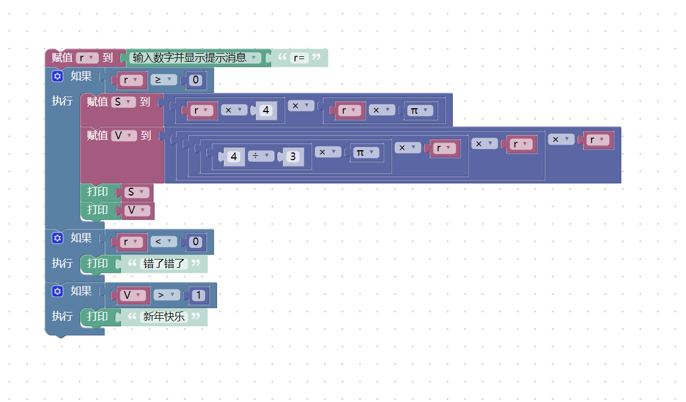
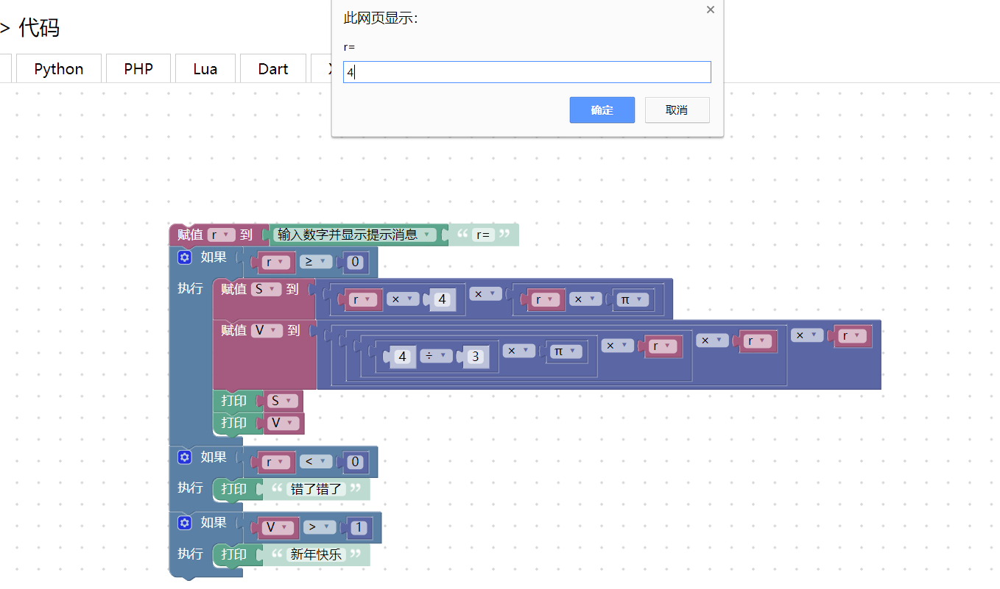
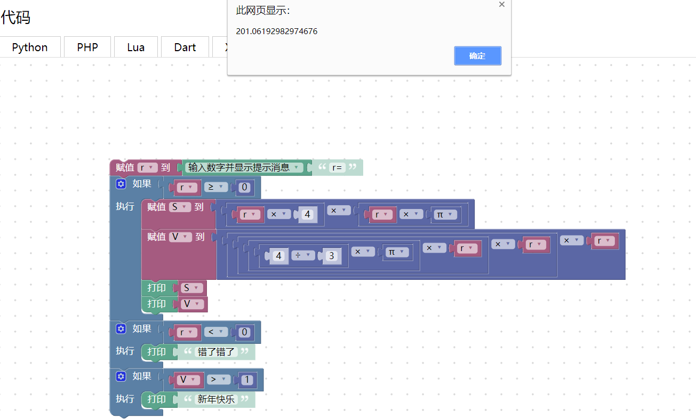
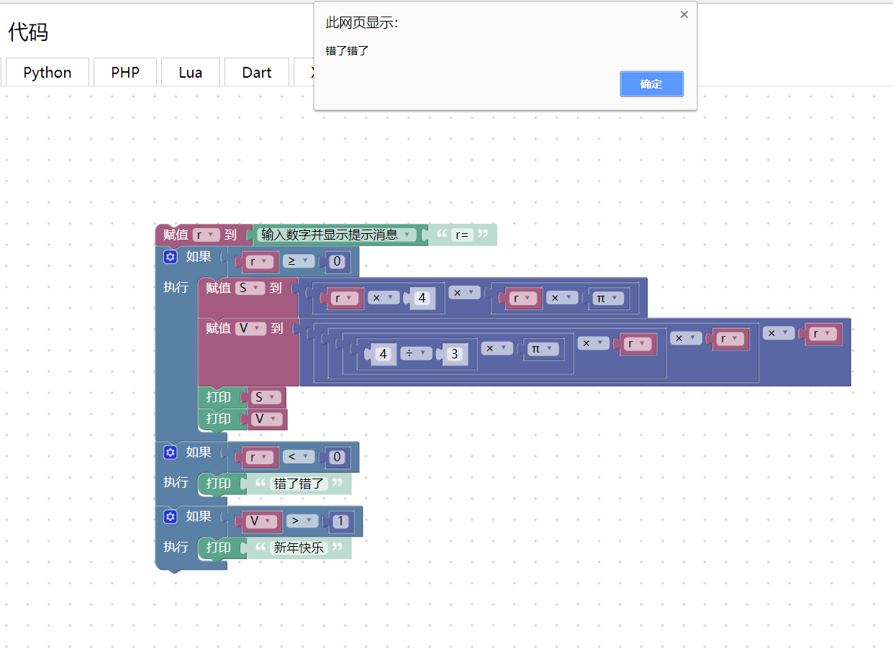
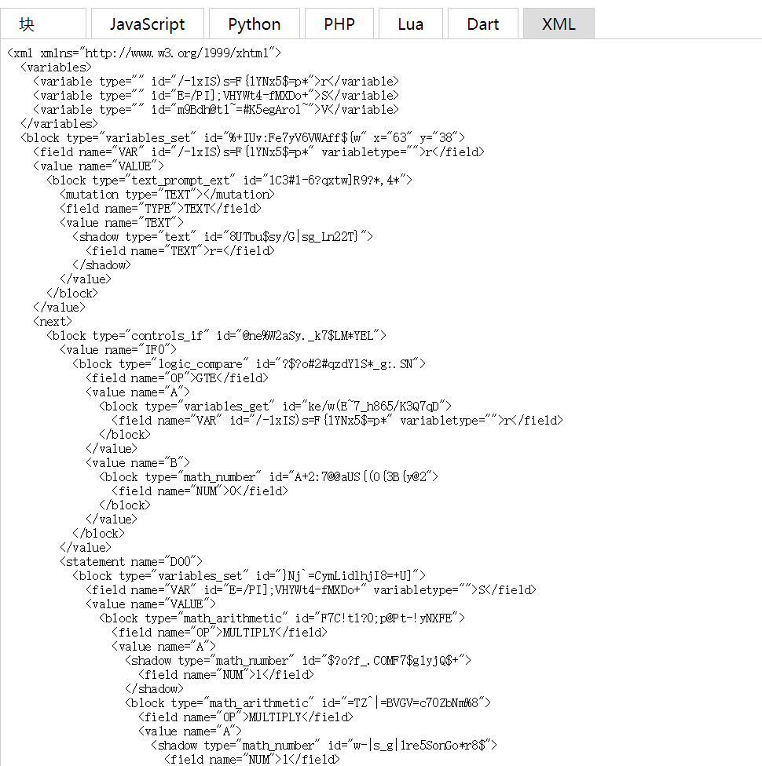
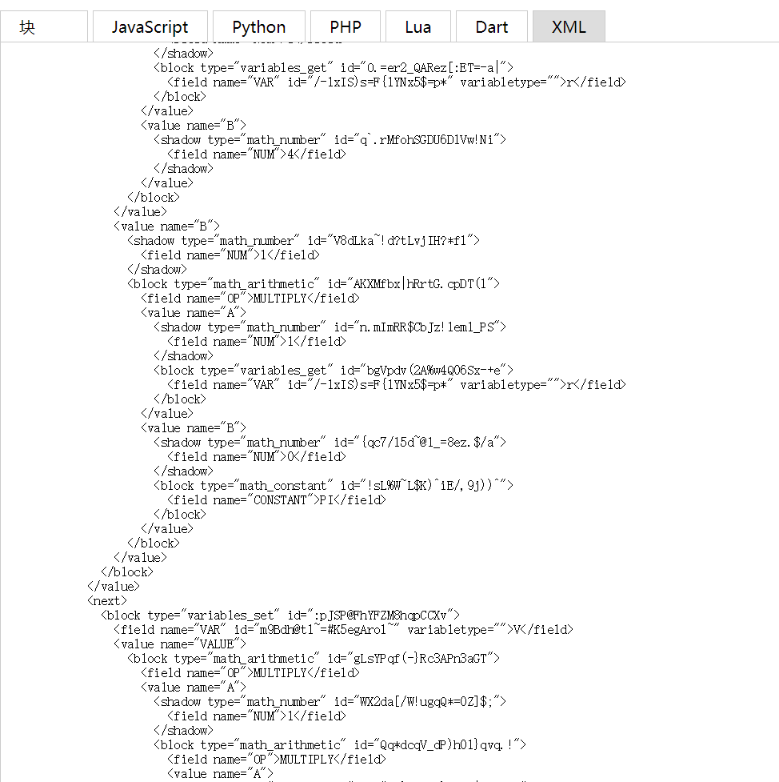

#个人案例
---
###16生物学翠英班张羽
---
###案例说明：
我做的程序不算太难，是给出r的数值算出圆的表面积和体积。R的数值可以输入正数也可以是负数，如果输入正数并且得到的体积大于一，就会弹出“新年快乐”，如果输入的数值小于零，就会弹出对话框提示错误。
 
 ---
 ###案例内容：
1.界面屏幕截图  
  
2.运行测试
  
  
  
  
  

---
###XML代码：
  
  
  

