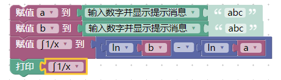
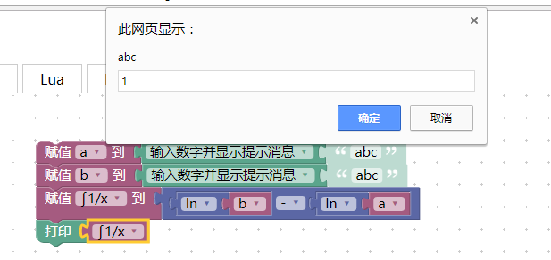
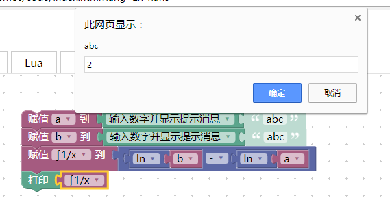
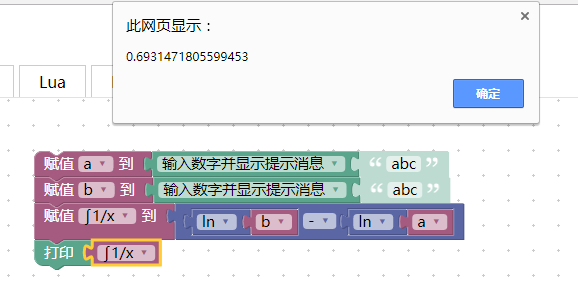

#个人案例
---
####17级物院四班徐国鹏（学号:320170936781）(第八组)
---
####案例说明：
这个案例是用于计算1/x从a到b的积分，输入a和b 的值即可得到1/x的积分结果。
---
####案例内容：
#####1.界面和模块截图
  
#####2.运行测试  
首先输入a=1  
  
再输入b=2  
  
然后得出结果  
  

---
###XML代码：
```
<xml xmlns="http://www.w3.org/1999/xhtml">
  <variables>
    <variable type="" id="pH?$gt8~(zHvnKoJm42^">a</variable>
    <variable type="" id="nxX/@~jJWF%i[RLn|)0P">b</variable>
    <variable type="" id="l-v}cK-$_wXI@G06y~02">1/x</variable>
    <variable type="" id="-D/;!y,1)Reup0NbbG55">∫1/x</variable>
    <variable type="" id="3U)`GG:J9TdUZ7fmos-9">lnx</variable>
    <variable type="" id="qS!]UlGQPr=8lNnJe$QW">lna</variable>
    <variable type="" id="B%Rrlv,#HlHJhsTWg!{M">lnb</variable>
    <variable type="" id="xXQ8%c/@T,B--SFI[6rf">∫x</variable>
  </variables>
  <block type="variables_set" id="q7S9@eSUitd8`.5O%fgC" x="313" y="63">
    <field name="VAR" id="pH?$gt8~(zHvnKoJm42^" variabletype="">a</field>
    <value name="VALUE">
      <block type="text_prompt_ext" id="-|B.jlJcE6;DT`Lo!L4L">
        <mutation type="NUMBER"></mutation>
        <field name="TYPE">NUMBER</field>
        <value name="TEXT">
          <shadow type="text" id="GDGDoZ;;dD1fUUUPieGe">
            <field name="TEXT">abc</field>
          </shadow>
        </value>
      </block>
    </value>
    <next>
      <block type="variables_set" id="/VZQ_`uDd`m,w.yGFKWY">
        <field name="VAR" id="nxX/@~jJWF%i[RLn|)0P" variabletype="">b</field>
        <value name="VALUE">
          <block type="text_prompt_ext" id="opTlx#|#NJ$$kUD*MWwj">
            <mutation type="NUMBER"></mutation>
            <field name="TYPE">NUMBER</field>
            <value name="TEXT">
              <shadow type="text" id="DI8In`Xu7$,MV!pge*4z">
                <field name="TEXT">abc</field>
              </shadow>
            </value>
          </block>
        </value>
        <next>
          <block type="variables_set" id="[hIY-):}5);da+NY[e9?">
            <field name="VAR" id="-D/;!y,1)Reup0NbbG55" variabletype="">∫1/x</field>
            <value name="VALUE">
              <block type="math_arithmetic" id="HcGZX0[}:[mF=gHln},5">
                <field name="OP">MINUS</field>
                <value name="A">
                  <shadow type="math_number" id="TdGpfT#w[2wzP+UCTjtj">
                    <field name="NUM">1</field>
                  </shadow>
                  <block type="math_single" id="/hckdX.I?zIK-X_?HuV/">
                    <field name="OP">LN</field>
                    <value name="NUM">
                      <shadow type="math_number" id="u0F?Mj;XE0{4)3=]^UGu">
                        <field name="NUM">9</field>
                      </shadow>
                      <block type="variables_get" id="H3X2W!#02P{9h],`:t`O">
                        <field name="VAR" id="nxX/@~jJWF%i[RLn|)0P" variabletype="">b</field>
                      </block>
                    </value>
                  </block>
                </value>
                <value name="B">
                  <shadow type="math_number" id="1Uxj,[o|DdXtj/+)fX[v">
                    <field name="NUM">1</field>
                  </shadow>
                  <block type="math_single" id="NzmZo4n81bb)Cl[rF?(A">
                    <field name="OP">LN</field>
                    <value name="NUM">
                      <shadow type="math_number" id="0(W9ie(nukcl.3`4f5V@">
                        <field name="NUM">9</field>
                      </shadow>
                      <block type="variables_get" id="u?jp2~Q8,7Lw$VW^~^fY">
                        <field name="VAR" id="pH?$gt8~(zHvnKoJm42^" variabletype="">a</field>
                      </block>
                    </value>
                  </block>
                </value>
              </block>
            </value>
            <next>
              <block type="text_print" id="$q/gX%7FrFk,2|C|cV:A">
                <value name="TEXT">
                  <shadow type="text" id="m!Al6*NWB#q2KlZ,7C(-">
                    <field name="TEXT">abc</field>
                  </shadow>
                  <block type="variables_get" id="B.8#i#7;2Bb{+!$]]-1R">
                    <field name="VAR" id="-D/;!y,1)Reup0NbbG55" variabletype="">∫1/x</field>
                  </block>
                </value>
              </block>
            </next>
          </block>
        </next>
      </block>
    </next>
  </block>
</xml>

```


